# Practice Azure Bot

----------------------------------------------------------------
##### -Go to this [URL](https://www.qnamaker.ai/Home/MyServices).
##### -Click on Create a knowledge base.
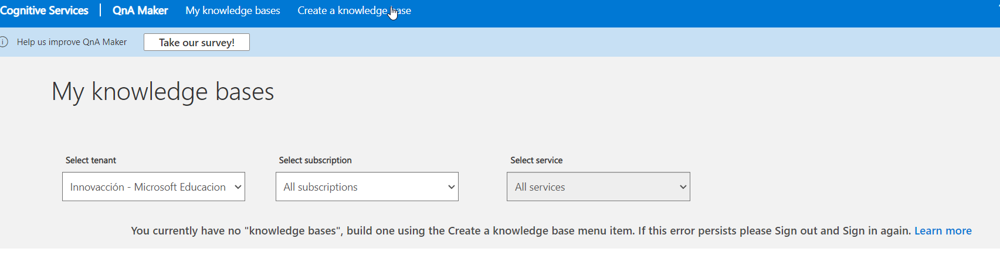
##### -Create a QnA Service.
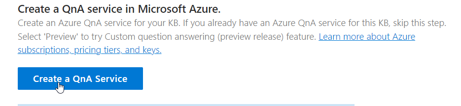
##### -This will redirect to portal.azure.com
##### -Select a resource group created or create a new one.
##### -Choose a pricing tier.
##### -Choose an Azure Search pricing.
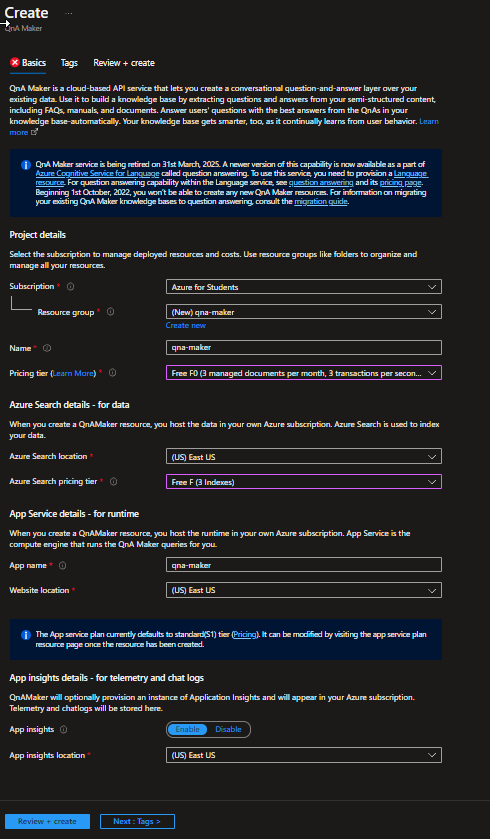
##### -Click on review and create.
##### -Now, we can select a resource group.
##### -Select a language.
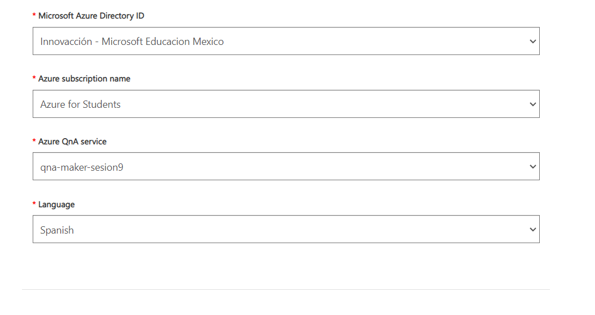
##### -Set a name.
##### -On chit-chat choose none.
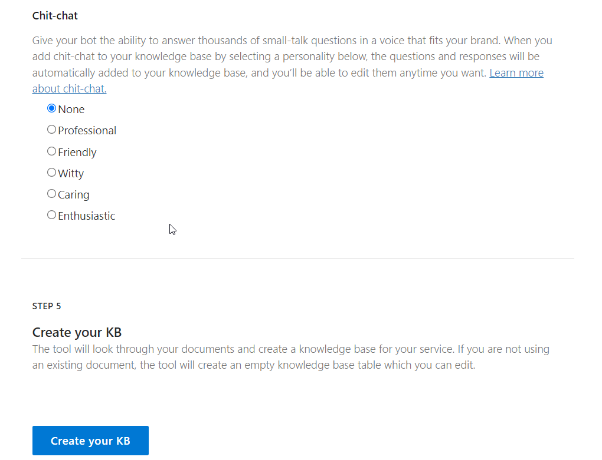
##### -And click on create your kb.
##### -Click on "+".
##### -We have to create asks and answers.
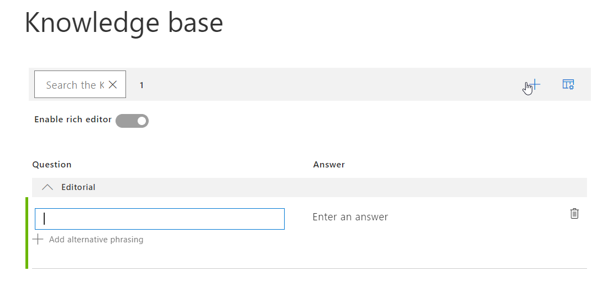
##### -You can put the questions and answers you want.
##### -Then, click on save aand train.
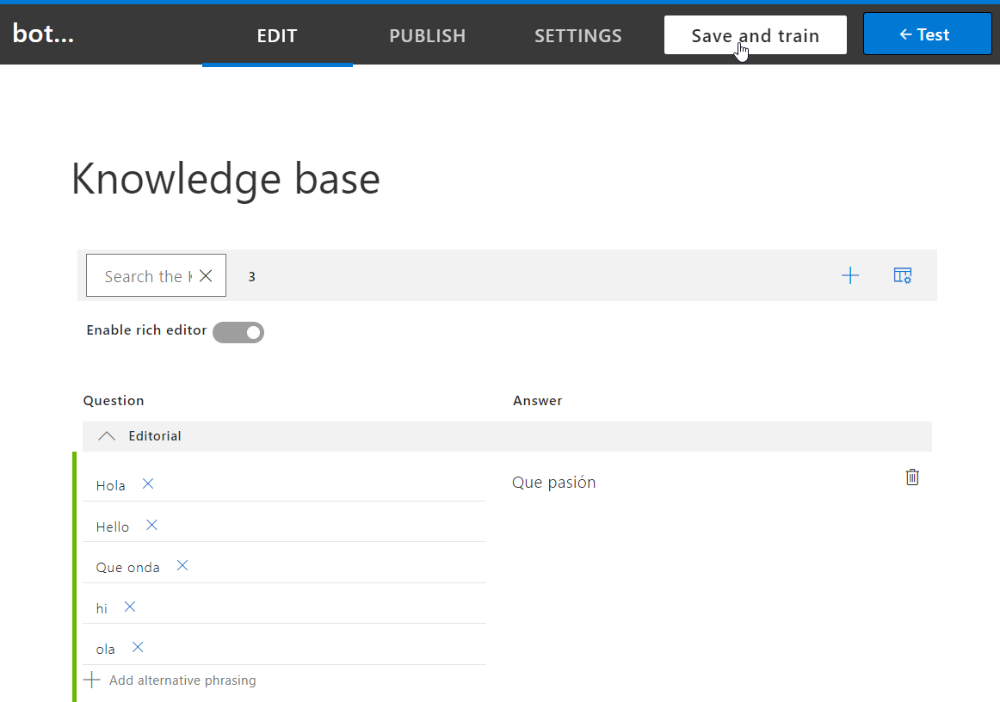
##### -Let´s test our bot, click on Test.
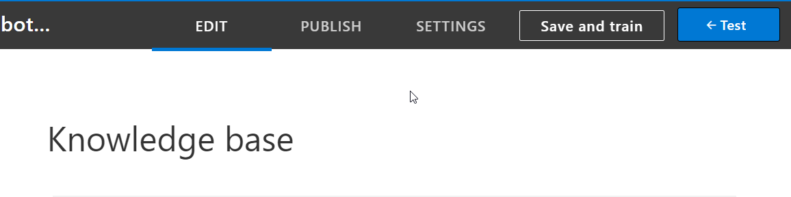
##### -Start to ask to the bot.
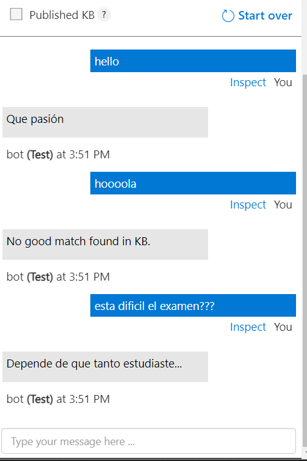
##### -The, click on publish section.
##### -And click on publish.
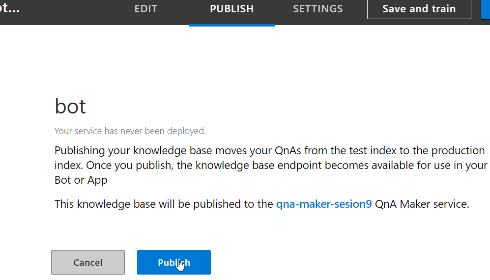
##### -Click on create bot.
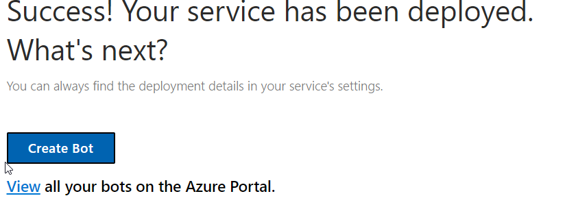
##### -If you want, you can chane the pricing tier, I choose the free and I will use Node.js and click on create.
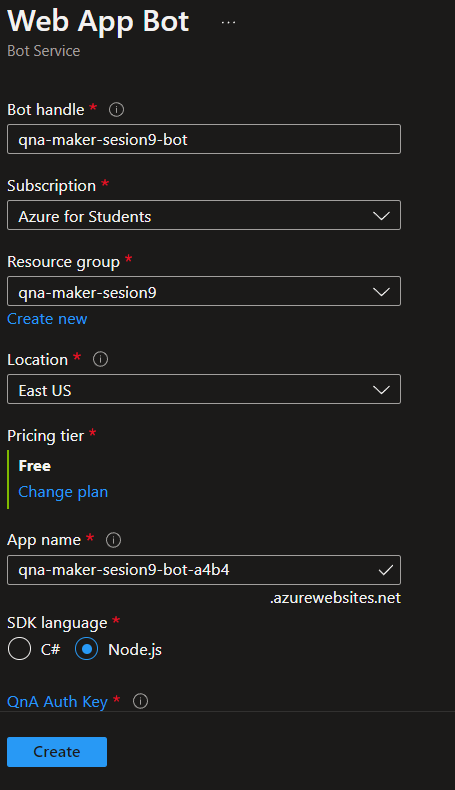
##### -Go to resource.
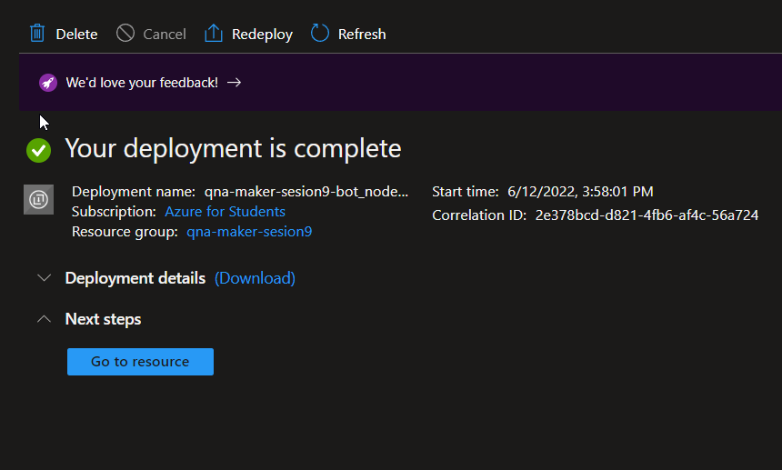
##### -Go to chanels, and you can choose where you display the bot.
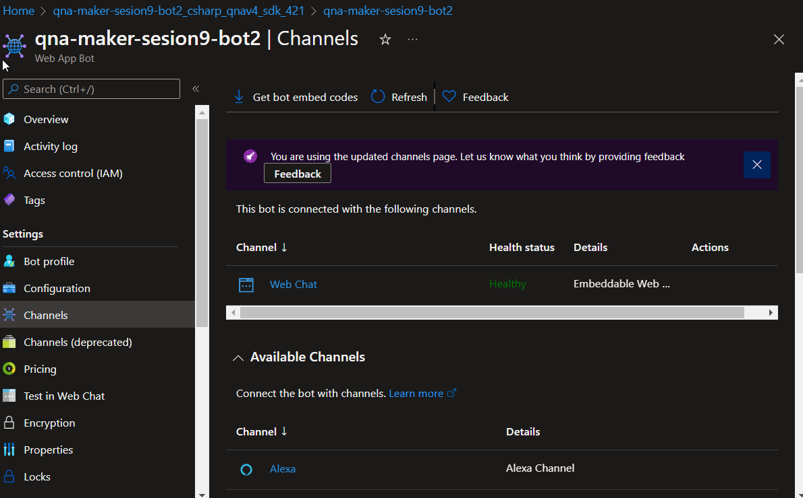
##### -I´ll choose microsoft teams, agree the terms of services.
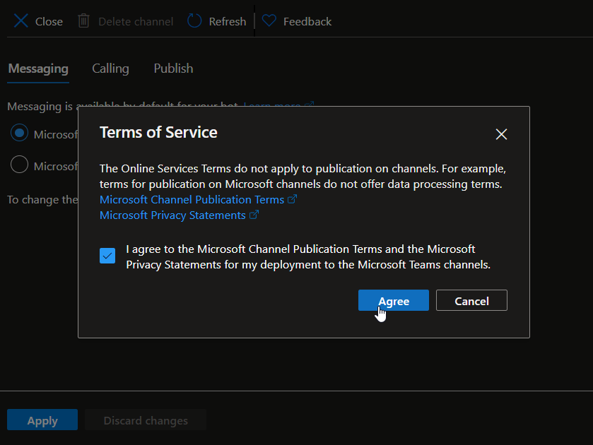
##### -Click on aplly the close.
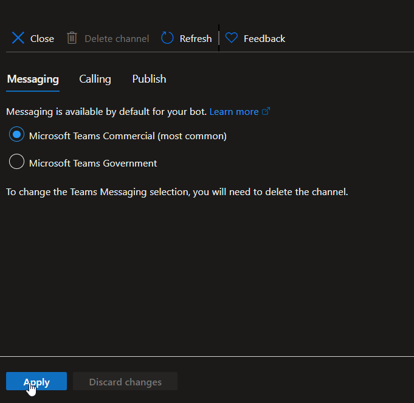
##### -Click in "open Teams" you can use download Teams, or use the browser.
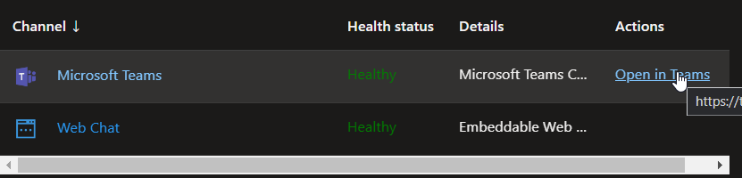
##### -So, we can start a conversation with your bot created.
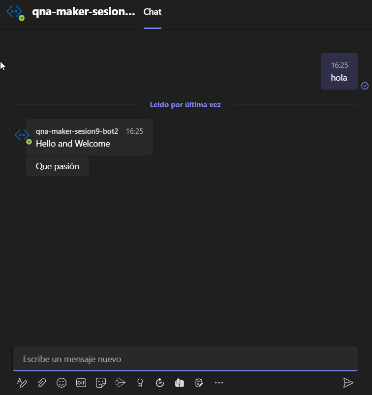
# 🔥🔥🔥Congratulations..! You created a bot...!!!🔥🔥🔥